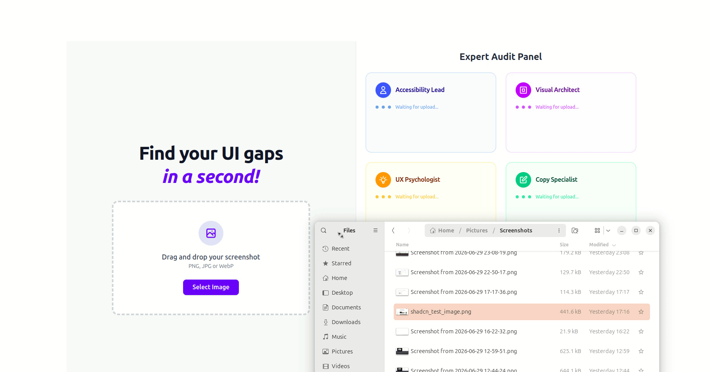

# Bruna UI 🎨

A minimalist, high-performance design critique tool powered by **Gemma 4 on Cerebras**. 

Bruna UI provides instant, professional-grade UX/UI audits by analyzing screenshots and delivering actionable feedback via a panel of specialized AI agents—all with ultra-low latency.



## 🚀 Core Loop
`Upload Screenshot` -> `WebSocket Transport` -> `Gemma 4 Analysis` -> `Categorized Critique`

## ✨ Features
- **Zero-Lag Feedback:** Built for millisecond-level responses using Cerebras' inference speed.
- **High-Signal Audits:** Specifically prompted to avoid "AI praise" and provide ruthless, constructive senior-level design critiques.
- **Parallel Expert Panel:** Instead of a single response, Bruna UI dispatches the analysis to four specialized agents in parallel, streaming a "blind review" from each:
  - **Accessibility Lead:** Focuses on WCAG compliance and inclusive design.
  - **Visual Architect:** Critiques grid alignment, hierarchy, and professional polish.
  - **UX Psychologist:** Analyzes cognitive load and mental model friction.
  - **Copy Specialist:** Mercilessly edits for clarity, brevity, and conversion.
- **Stateless Pipeline:** Designed for instant "One Frame -> One Response" flow with no database overhead.

## 🛠️ Tech Stack
- **Backend:** Rails (Minimal mode)
- **Frontend:** Hotwire (Turbo + Stimulus)
- **Transport:** ActionCable (WebSockets) for low-latency image transmission.
- **AI Model:** `gemma-4-31b` via the local Cerebras Ruby SDK.
- **Data Flow:** Base64 encoded image pipeline.

## 📦 Getting Started

### Prerequisites
- Ruby installed
- A `CEREBRAS_API_KEY`

### Installation
1. Clone the repository.
2. Create a `.env` file in the root directory:
   ```env
   CEREBRAS_API_KEY=your_key_here
   ```
3. Install dependencies (Bundler will fetch the exact `cerebras` gem version `0.1.0` from GitHub):
   ```bash
   bundle install
   ```

### Running the App
```bash
bin/dev
```

### 🧪 Verification
To ensure your `CEREBRAS_API_KEY` is configured correctly and the SDK is linked, run the smoke tests:

- **Test Basic API Call:** `ruby spec/smoke/test_api_call.rb`
- **Test Vision/Image Analysis:** `ruby spec/smoke/test_vision_sdk_call.rb`

## 🏗️ Architecture Principles
- **Extreme Minimalism:** Only dependencies essential to the visual loop are included.
- **Pinned SDK:** The `cerebras` gem is pinned to version `0.1.0` and fetched directly from its GitHub repository via Bundler.
- **Designed for Reasoning Separation:** Architecture is ready to separate model reasoning from the final critique to ensure a clean user experience should the model provide reasoning tokens.

## 🔗 Links & Submission

- **Live Demo:** [https://bruna-ui.onrender.com](https://bruna-ui.onrender.com)
- [Bruna UI announcement on X](https://x.com/ton_anywhere/status/2071643988721828352)
- [Cerebras Ruby SDK](https://github.com/ton-anywhere/cerebras-cloud-sdk-ruby) (dependency developed during the same hackathon)
- **Google Gemma-4 31B** was used to power and develop this project. [Model Page on Hugging Face](https://huggingface.co/google/gemma-4-31B)
- **Cerebras x Google Gemma 4** [Hackaton page](https://luma.com/cerebras-piwl)
